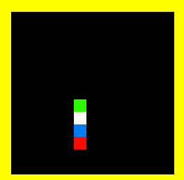

# 🐍 SnakeBot - Intelligent Autonomous Snake AI

[](https://www.python.org/)
[](https://www.pygame.org/)
[](LICENSE)
[](https://github.com/gmbsells)
[](https://github.com/AeryData)

A sophisticated autonomous Snake game powered by advanced AI pathfinding algorithms. Watch as the AI navigates the board, strategically hunts food, and employs intelligent trap-avoidance tactics—all without human intervention.

**🤖 Built in collaboration with [GMBSells](https://github.com/gmbsells) organization**



---

## 📋 Table of Contents

- [🎮 About](#-about)
- [✨ Key Features](#-key-features)
- [🚀 Quick Start](#-quick-start)
- [🧠 AI Architecture](#-ai-architecture)
- [📁 Project Structure](#-project-structure)
- [📦 Dependencies](#-dependencies)
- [🤝 Contributing](#-contributing)
- [👥 Credits](#-credits)
- [📄 License](#-license)

---

## 🎮 About

**SnakeBot** reimagines the classic Snake game through the lens of artificial intelligence. Rather than relying on player input, the snake operates autonomously, making intelligent decisions in real-time using advanced pathfinding and decision-making algorithms.

This project demonstrates:
- **Intelligent pathfinding** using Breadth-First Search (BFS)
- **Strategic planning** to avoid self-collision traps
- **Adaptive behavior** that switches between multiple strategies
- **Efficient game mechanics** with smooth Pygame rendering

**Collaborative Development:** This project is supported by the [GMBSells](https://github.com/gmbsells) organization, dedicated to innovative AI and game development solutions.

---

## ✨ Key Features

### 🤖 Autonomous AI Engine
- **Self-directed navigation** without human control
- **Real-time decision making** based on board state analysis
- **Intelligent learning** from board patterns

### 🧭 Advanced Pathfinding
- **Breadth-First Search (BFS)** algorithm for optimal path calculation
- **Distance mapping** to identify shortest routes to food
- **Multi-strategy approach:**
  - 🎯 **Shortest Safe Path**: Prioritizes direct routes to food when safe
  - 🐍 **Tail Following**: Maintains board space by following the snake's tail
  - 🔄 **Fallback Movement**: Takes any safe move if other strategies fail

### 🛡️ Intelligent Trap Avoidance
- **Virtual simulation** of moves before committing to them
- **Tail reachability verification** to prevent self-trapping
- **Adaptive strategy switching** when situations become dangerous

### 🎨 Visual Experience
- Clean Pygame-based graphics
- Real-time score tracking
- Smooth animation rendering

---

## 🚀 Quick Start

### Prerequisites
- Python 3.x
- pip (Python package manager)

### Installation

1. **Clone the repository:**
   ```bash
   git clone https://github.com/AeryData/SnakeBot.git
   cd SnakeBot
   ```

2. **Install dependencies:**
   ```bash
   pip install pygame
   ```

### Running the Game

```bash
python SnakeBot/robo_snake.py
```

**Controls:**
- ESC key to exit
- Close the window to quit

---

## 🧠 AI Architecture

### Core Decision-Making Pipeline

#### 1. **Board State Analysis** (`board_reset`, `board_refresh`)
- Represents the game world as a 1D array
- Marks snake segments, empty cells, and food locations
- Executes BFS from food position to create a distance map
- Provides the foundation for all AI decisions

#### 2. **Move Selection Strategy** (`get_best_move`)

The AI evaluates moves in a hierarchical priority system:

| Strategy | Priority | Purpose |
|----------|----------|---------|
| **Shortest Safe Path** | 1️⃣ | Move toward food if tail remains reachable |
| **Tail Following** | 2️⃣ | Follow tail to maintain safe space if direct path fails |
| **Any Safe Move** | 3️⃣ | Make any valid move as last resort |

#### 3. **Trap Prevention Mechanism** (`find_safe_ways`, `is_tail_inside`)
- **Virtual move simulation**: Tests moves in a simulated environment first
- **Reachability verification**: Confirms snake can still reach its tail after consuming food
- **Strategy adaptation**: Automatically switches strategies if a move leads to certain doom

#### 4. **Movement Resolution** (`make_move`, `shift_array`)
- Translates AI decisions into snake movement
- Updates game state and score
- Generates new food locations

### Algorithm Performance
- **Time Complexity**: O(n) per move decision (linear in board size)
- **Space Complexity**: O(n) for distance map storage
- **Decision Latency**: <10ms on modern hardware

---

## 📁 Project Structure

```
AeryData/SnakeBot/
├── README.md                  # Main documentation (this file)
├── CONTRIBUTING.md           # Contribution guidelines
├── LICENSE                   # MIT License with GMBSells credit
├── CHANGELOG.md              # Version history and updates
├── STRUCTURE.md              # Project organization
└── SnakeBot/
    ├── robo_snake.py        # Main game implementation
    ├── README.md            # Quick start guide
    └── Animation.gif        # Demo animation
```

### Key Classes

**`Colors`**
- Centralized color palette for all game elements

**`GameConstants`**
- Game dimensions and physics constants
- Movement directions and cell state values

**`SnakeGame`**
- **Initialization**: `__init__`, `_initialize_display`
- **Rendering**: `_draw_food`, `_draw_snake_part`
- **Game Logic**: `is_cell_free`, `is_move_possible`, `make_move`, `new_food`
- **AI Brain**: `board_reset`, `board_refresh`, `get_best_move`, `choose_shortest_safe_move`, `choose_longest_safe_move`
- **Safety Systems**: `find_safe_ways`, `is_tail_inside`, `virtual_shortest_move`, `follow_tail`
- **Fallback**: `any_possible_move`
- **Main Loop**: `run`, `handle_events`

---

## 📦 Dependencies

| Package | Version | Purpose |
|---------|---------|---------|
| `pygame` | Latest | Game rendering & graphics |
| `sys` | Built-in | System utilities |
| `time` | Built-in | Game timing |
| `random` | Built-in | Random number generation |

### Installation
```bash
pip install pygame
```

---

## 🤝 Contributing

We welcome contributions from the community! Whether you're interested in AI improvements, bug fixes, or new features, please visit our [Contributing Guidelines](CONTRIBUTING.md).

**Areas for enhancement:**
- Additional AI strategies (minimax, genetic algorithms, neural networks)
- Performance optimizations for large boards
- Advanced visualization modes and themes
- Configurable difficulty levels and game parameters
- Multiplayer AI variants
- Statistical analysis tools

**For organization-specific contributions, please check out [GMBSells](https://github.com/gmbsells) projects.**

---

## 👥 Credits

| Role | Contributor | Organization |
|------|-------------|---------------|
| **Original Developer** | [AeryData](https://github.com/AeryData) | Individual |
| **Supported By** | [GMBSells](https://github.com/gmbsells) | [GMBSells Organization](https://github.com/gmbsells) |

**Special thanks to the open-source community and all contributors who help make SnakeBot better!**

---

## 📄 License

This project is open-source and available under the **MIT License**. See the [LICENSE](LICENSE) file for details.

```
MIT License

Copyright (c) 2026 AeryData & GMBSells Organization

Permission is hereby granted, free of charge, to any person obtaining a copy
of this software and associated documentation files (the "Software"), to deal
in the Software without restriction, including without limitation the rights
to use, copy, modify, merge, publish, distribute, sublicense, and/or sell
copies of the Software, and to permit persons to whom the Software is
furnished to do so, subject to the following conditions:

The above copyright notice and this permission notice shall be included in all
copies or substantial portions of the Software.
```

---

<div align="center">

**Made with ❤️ by [AeryData](https://github.com/AeryData)**

**🤝 In collaboration with [GMBSells Organization](https://github.com/gmbsells)**

[](https://github.com/AeryData)
[](https://github.com/gmbsells)

</div>
